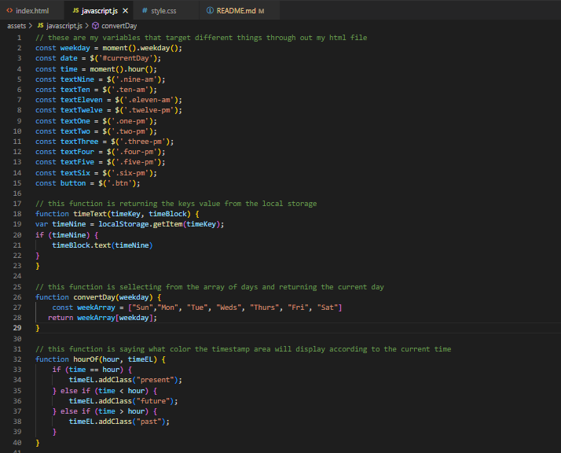
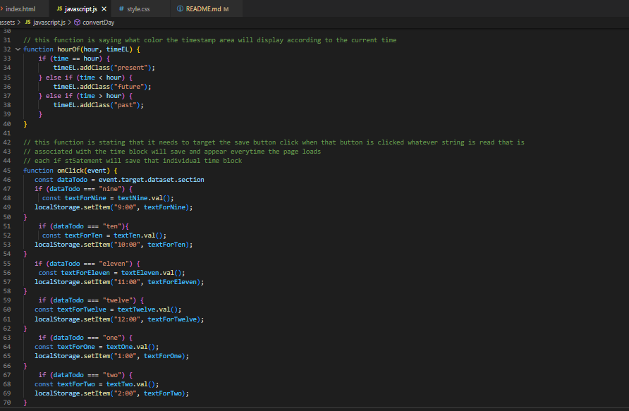

# schedule-planner

## Description 

This page is a day planner that saves your todo list. It also displays which day of the week it is. The planner is only for normal business hours from 9AM-6PM. When the hour has passed the todo list item will change colors to grey, when its the current hour the todo item will display red, and for the time that hasnt come the todo items will appear green. You can input any text or todo item inside the time blocks and clicks save. Saving will save to the local storage and keep the todo items on the page even when refreshed till removed.

[Deployable-Link](https://sufyaanvaidya.github.io/schedule-planner/)

## Installation

1. I created a repository to store and add my starter files.
2. After the starter files were added i added the time blocks.
3. To style the html i used the bootstrap that was already linked to the html.
4. With all the html already styled i added a new jascript file.
5. On that js file i used jquery to target the classes on html and made them equal to a const, and conts with moment.js to get the current day and current time.
6. Now i created a function that displays the day at the top and changes to the current day.
7. Now i created the function that will change the colors of the block based of the current time and the block time.
8. Then i created a function that targets each time block and adds the user input into the local storage with their own keys and keeps them on the page.
9. Next i created an even listener to all the buttons with jquery and calling on a function for the onclick.
10. Now i made the date display in the correct position on the page with the targetted area .text and the function for the day.
11. I targetted those consts and added event listeners that activate a function on a click of the const
12. Next i called on the function thats comparing the times and gave the parameters the value for the timeblocks time and the area it needed to appear in.
13. finally i called on the function that saves the user input from the local storage to the page and keeps it onto the page.

## Usage 

## Credits

- Sufyaan Vaidya (https://github.com/SufyaanVaidya)
- (https://stackoverflow.com/)
- (https://api.jquery.com/)
- (https://momentjs.com/docs/#/get-set/)

## Technology Used

- HTML
- CSS
- Javascript
- jquery
- Bootstrap

## License

- [This-website-has-an-MIT-license](https://github.com/SufyaanVaidya/schedule-planner/blob/ae55012c2dc10bcc2c58b98efe2a5f18832208ab/LICENSE)